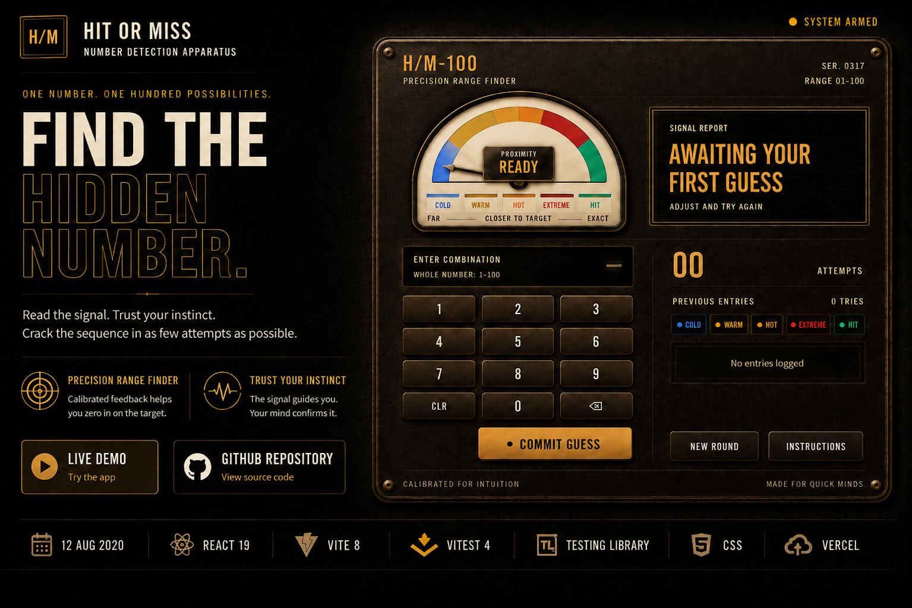

# Hit or Miss

[](https://react-hit-and-miss-app.vercel.app/)

A number-guessing game rebuilt from an early React learning project into a complete, tested and deployable web application.

The original game mechanic has been preserved. The interface, feedback system, responsive behaviour, accessibility, testing and development setup have been modernised.

**Status:** Complete  
**Project type:** Legacy modernisation  
**Stack:** React, Vite, Vitest, Testing Library, CSS  
**Live:** [Play Hit or Miss](https://react-hit-and-miss-app.vercel.app)

## Overview

The player has to find a hidden number between 1 and 100.

Each unsuccessful guess returns two forms of feedback:

- temperature: Cold, Warm, Hot or Extreme;
- direction: Too High or Too Low.

The interface uses an analogue-style proximity gauge, mechanical keypad and colour-coded attempt history to make that feedback easy to read.

## Modernisation

The original version was an early React learning project. The aim was not to change the basic idea, but to take the project through a proper modernisation and release process.

### Preserved

- Original game concept
- Core 1 to 100 guessing mechanic
- Existing repository history

### Rebuilt

- React and Vite development setup
- Responsive Bakelite-and-brass interface
- Clear proximity gauge and temperature states
- High and low directional feedback
- Vertical colour-coded attempt history
- Win state and New Game flow
- Keyboard-friendly controls
- Semantic HTML and accessibility improvements
- Reduced-motion support
- Automated tests
- GitHub Actions CI
- Production deployment on Vercel

## Engineering decisions

The game mechanic is deliberately simple. Most of the work is in the presentation, interaction states and completion quality.

The temperature system uses named states rather than a percentage because the game is communicating proximity, not probability.

Previous guesses are kept in a vertical history so the player can compare attempts without covering the gauge or compressing the guess values.

The gauge and guess controls have separate layout areas so the main feedback instrument remains visible at all supported screen sizes.

## Technology

- React 19
- Vite 8
- Vitest 4
- Testing Library
- CSS
- GitHub Actions
- Vercel

## Run locally

Requires Node.js 22.12 or newer and npm.

```bash
npm install
npm run dev
```

## Quality checks

```bash
npm test
npm run build
```

The GitHub Actions workflow runs the test suite and production build on changes to `master`.

## How to play

1. Enter a whole number from 1 to 100.
2. Read the temperature and high or low feedback.
3. Use the gauge and previous entries to narrow the range.
4. Find the hidden number in as few attempts as possible.
5. Start a new game when the target is found.

## Scope

This is intentionally a small front-end project. Its purpose in the portfolio is to show the restoration and modernisation of an older project through design, implementation, testing, repository cleanup and production deployment.

## License

MIT. See [LICENSE](LICENSE).
